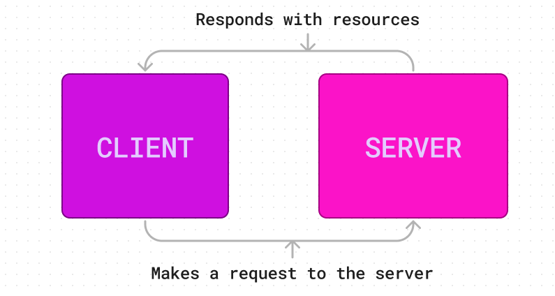

### TASKS:
Setup a Node.js Package using npm
Create CommonJS modules
Create a simple express server
See passing tests via CI using GitHub actions (Continuous Integration)

[Repository](https://github.com/Mandamarie90/server-deployment-practice)

[Pull Request](https://github.com/Mandamarie90/server-deployment-practice/pull/1)

[Github Actions](https://github.com/Mandamarie90/server-deployment-practice/actions)

### UML

